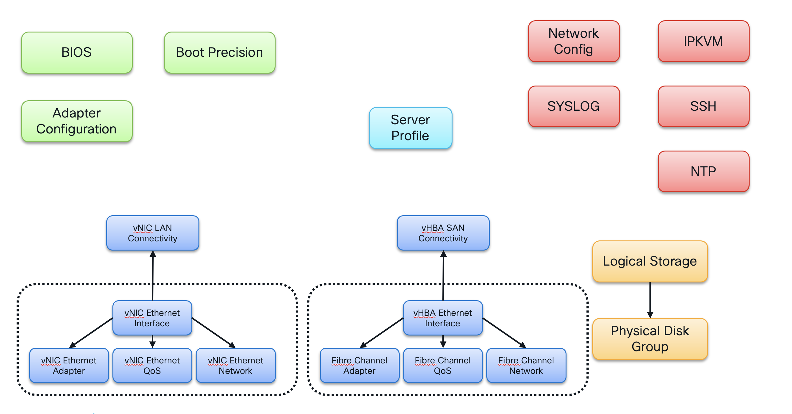

# UCS C-series Standalone Server Profile

The Intersight provider is built directly from the OpenAPI-based Intersight REST API and its representation of the underlying data models. At the time of this writing, the Intersight provider does not provide high level resources such as a single resource representing a network interface or network adapter. Ultimately, that abstraction will be provided by Terraform modules.

From my experience, at this point in time, I recommend approaching the provider as an easier to consume interface for the direct REST API calls. Or, put another way, it's a simplified means (using Terraform Hashicorp Language) to make REST API calls without the need to write a lot of Python REST overhead.

It is under **active, rapid** development so please provide feedback via the [GitHub Issues](https://github.com/CiscoDevNet/terraform-provider-intersight/issues) page for the engineering team to have visibility with provider usage issue.  Also, reference that page to investigate possible reasons for behaviors in this example repo differing from documented.

## Intersight Model

Since the provider essentially maps directly to the exact model representation present in the REST API, it's essential to understand the model at least with respect to the server profile.



The Intersight Terraform provider resources map directly to those models, as demonstrated by the Terraform configuration in this directory.

## Creating the Server Profile

In addition to the authentication related environment variables you defined in the hands-on exercise (TF_VAR_apikey, TF_VAR_secretkey, TF_VAR_target_organization), you are strongly advised to also define some additional environment variables related to this Terraform example. Those variables can be found in the [variables.tf](./variables.tf) file. The critical variable to set would be the **dcnm** user password:

```bash
export TF_VAR_dcnm_password='S0meTh!ngSecur3'
```

Beyond those customizations, the standard Terraform operations apply at this point:

```bash
terraform init
terraform plan
terraform apply
```

## References 

- [Terraform Registry Intersight Provider documentation](https://registry.terraform.io/providers/CiscoDevNet/intersight/latest/docs)
- [Terrafor Provider for Intersight GitHb docs/examples](https://github.com/CiscoDevNet/terraform-provider-intersight)
- [Intersight API Reference](https://intersight.com/apidocs/apirefs/)
