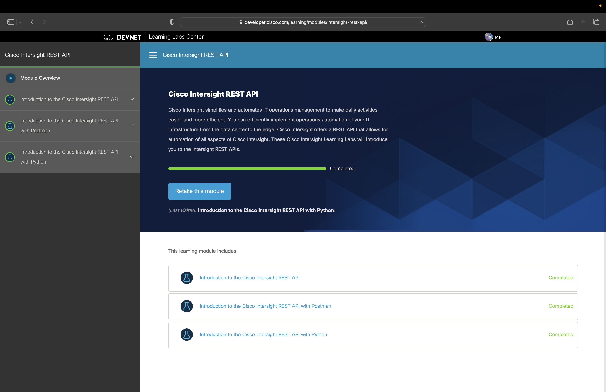
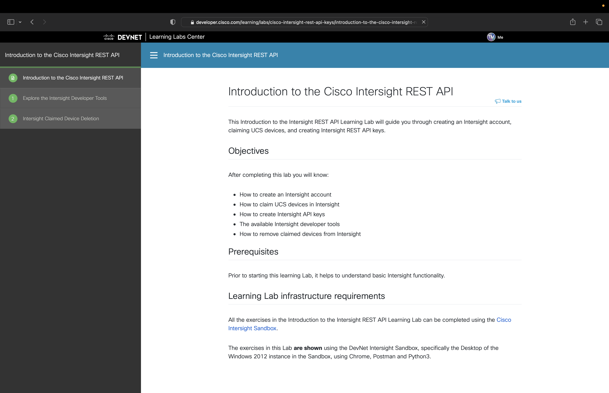

# Automating Cisco UCS Server Provisioning with Terraform and Intersight 

This hands-on workshop will walk you through the process of setting up Terraform to manage your Intersight resources, from API credential generation through building policies for UCS server profiles managed by Intersight.

The ideal foundation for attendees of this workshop is to have completed the [Cisco Intersight REST API](https://developer.cisco.com/learning/modules/intersight-rest-api/) learning module:

or, at the every least, have completed the [Introduction to Cisco Intersight REST API](https://developer.cisco.com/learning/labs/cisco-intersight-rest-api-keys/introduction-to-the-cisco-intersight-rest-api/) learning track.

For this workshop, in an effort to support a broader audience, we'll focus on a subset of the policies needed for profile creation to mitigate the need for extensive API experience.

## Workshop Outline

Prior to landing on this workshop, you followed the presenter in creating a server profile in the Intersight interface with a goal to understand the configuration and policies that you will be automating. The Intersight accounts to which you have access for the onsite workshop will have a server profile example already loaded and be ready for you to recreate some of the policies via Terraform.

To successfully complete this learning track, you will:
- [Create Intersight REST API keys](./01-create-api-keys.md)
- [Creating Terraform for IPMI Policy](./02-terraform-intersight-ipmi.md)
- [Creating Terraform for Serial over LAN Policy](./02-terraform-intersight-serial-lan.md)
- [Creating Terraform for IP KVM Policy](./02-terraform-intersight-ipkvm.md)

Direct navigation to each section is not necessary as the learning lab platform will provide the workflow navigation at the bottom of the page.

## Prerequisites

The following technologies and initial setup is required prior to engaging this workshop.

- [Git](https://git-scm.com)
- [Terraform 1.1.9](https://www.terraform.io/downloads)
- [Terraform Provider 1.0.35](https://registry.terraform.io/providers/CiscoDevNet/intersight/latest)
- [Cisco Intersight Account](https://intersight.com)
    - For lab purposes, Cisco Intersight trial license will suffice
    - For production purposes, Cisco Intersight Essentials License
- Cisco UCS Servers
    - UCS C-series: Any M4 or newer generation
    - UCS 6454 Fabric Interconnects
    - UCS B-series or C-series connected to FIs: M4 or newer with VIC1400 or newer adapters

*_This list is for your information only._*
The software and command line terminal are provided for you in this session and so no installation is required. And, for Cisco Live in-person delivery, the required Intersight and UCS hardware will be provisioned ahead of time on your behalf.
