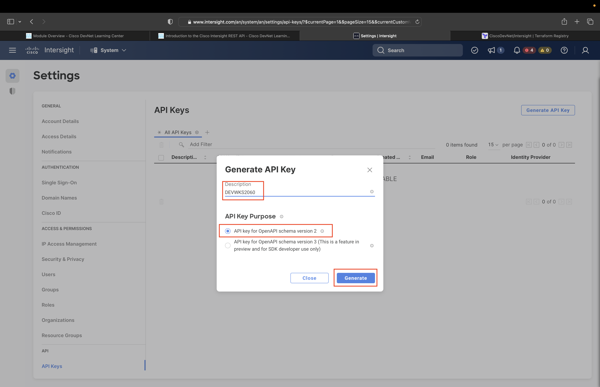

# Intersight REST API Key Generation

Before we begin, we need to download all the code related to this workshop from [GitHub repository](https://github.com/CiscoSE/DEVWKS-2060-CLAMS23).

```bash
cd /home/developer/src
git clone https://github.com/eti-tme-tim/DEVWKS-2060-CLAMS23
cd DEVWKS-2060-CLAMS23
```

## Intersight Portal API Key Generation

In this section, you will leverage your Intersight credentials to generate the REST API Key Id and Secret Key information necessary to authenticate your Terraform provider and configuration with Intersight.

You'll begin by opening a new browser window or tab, navigate to the Intersight portal:

[Intersight via intersight.com](https://intersight.com)


Log into Intersight with the "Cisco ID" option (shown above) using the provided credentials.

Some of your accounts may still be in the "first time login" stage, in which case you'll be presented with the option to take an Intersight tour.  Please skip it:


You'll be presented with one of the following dashboards (first one is for new accounts, second is for return accounts):


Which dashboard you land on doesn't affect how you proceed next so don't panic if you don't have the same dashboard as your neighbor.

To generate the API keys, you'll need to navigate to the account settings via the indicated gear icon (image above) and menu selection indicated below.


In the settings pane, select the API Keys Menu (image below)


and press the Generate API Key button in the upper right (image below).


You'll be presented with the options needed for key generation:



For this session, the automation relies on "Schema Version 2". In a production environment, you would provide a meaningful description but that's optional for this workshop. Click "Generate".


After generating the key, you'll get the screen below. Whatever you do, **do not close the dialog box**!!!!


The above screen is the most important part of the process. If you close it without saving the information, you'll have to start over again.

You will save the API Key Id by copying it to the clipboard and then saving it to a file in the terminal.

```bash
cat > DEVWKS-2060-Default-KeyID.txt
```

Paste the API Key ID value in the terminal (Ctrl-V on PC, Cmd-V on Mac, right-click->Paste on Linux) and then leave the edit session (Ctrl-D).

Next, you will save the API Secret Key. Normally you would download it to the proper location. For this session, we'll copy the contents to the clipboard like we did above and paste them into the correct file.

```bash
cat > DEVWKS-2060-Default-Secret.txt
```

Paste the API Secret Key File contents in the terminal (Ctrl-V on PC, Cmd-V on Mac, right-click->Paste on Linux) and then leave the edit session (Ctrl-D).

Those actions store the credentials for the duration of this session. However, the Terraform we will be running requires those contents to be stored in environment variables, which we'll set as follows:

```bash
export TF_VAR_apikey=$(cat DEVWKS-2060-Default-KeyID.txt)
export TF_VAR_secretkey="${PWD}/DEVWKS-2060-Default-Secret.txt"
```

One additional step is required - defining your workshop "target_organization" based on your credentials. The command below requires you to provide the actual value indicated on your credential sheet, replacing "studentX".

```bash
export TF_VAR_target_organization=studentX
```

In production environments, please choose to conform to better security practices than this.

## Testing the Keys

Finally, we are going to test the credentials to ensure everything is set up correctly.  From the [Overview](./00-overview.md) module, you cloned the workshop's GitHub repository into the **${HOME}/src** directory.

```bash
cd ${HOME}/src/DEVWKS-2060-CLAMS23/01-setup
terraform init
terraform plan
terraform apply --auto-approve
```

For successfully authentication set up, you'll see the following output for each command.

### terraform init

```
Initializing the backend...

Initializing provider plugins...
- Finding ciscodevnet/intersight versions matching "1.0.28"...
- Installing ciscodevnet/intersight v1.0.28...
terraform plan
- Installed ciscodevnet/intersight v1.0.28 (signed by a HashiCorp partner, key ID 7FA19DB0A5A44572)

Partner and community providers are signed by their developers.
If you'd like to know more about provider signing, you can read about it here:
https://www.terraform.io/docs/cli/plugins/signing.html

Terraform has created a lock file .terraform.lock.hcl to record the provider
selections it made above. Include this file in your version control repository
so that Terraform can guarantee to make the same selections by default when
you run "terraform init" in the future.

Terraform has been successfully initialized!

You may now begin working with Terraform. Try running "terraform plan" to see
any changes that are required for your infrastructure. All Terraform commands
should now work.

If you ever set or change modules or backend configuration for Terraform,
rerun this command to reinitialize your working directory. If you forget, other
commands will detect it and remind you to do so if necessary.
```

### terraform plan

```
No changes. Your infrastructure matches the configuration.

Terraform has compared your real infrastructure against your configuration and found no differences, so no changes
are needed.
```

### terraform apply --auto-approve

```
No changes. Your infrastructure matches the configuration.

Terraform has compared your real infrastructure against your configuration and found no differences, so no changes are needed.

Apply complete! Resources: 0 added, 0 changed, 0 destroyed.
```

Aside from not seeing any errors (or Terraform actually creating any new state), you can validate you received existing state for the default organization by listing the state data stored in the local Terraform state file.

```bash
terraform state list
```

The output should be:

```
data.intersight_organization_organization.default
```

Congratulations, you are now all set to begin automating the deployment of your Intersight environment.
