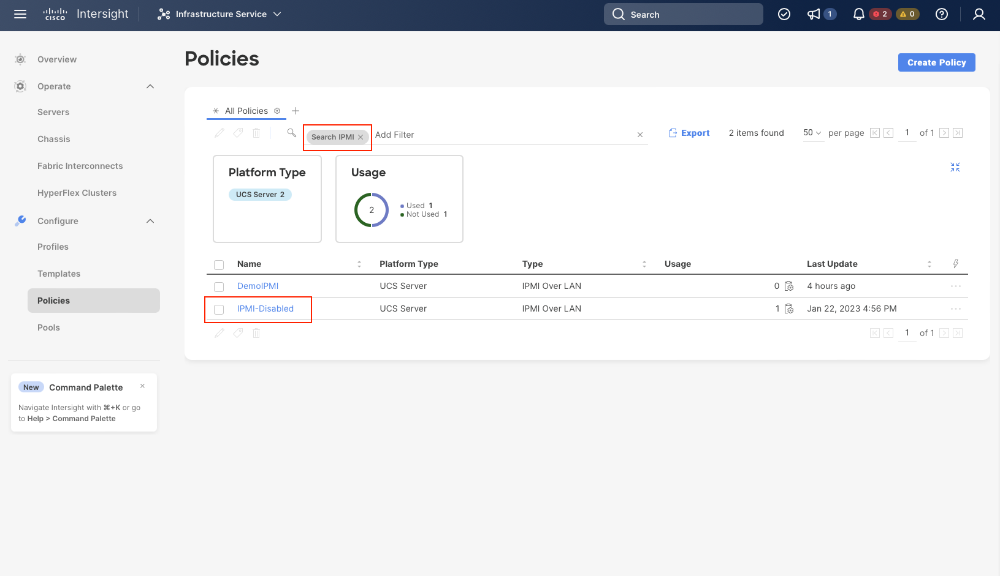
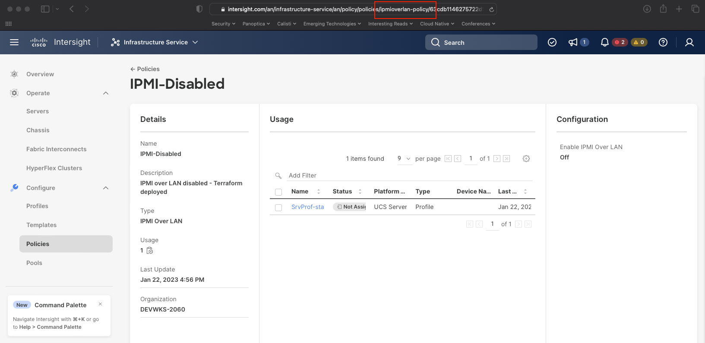
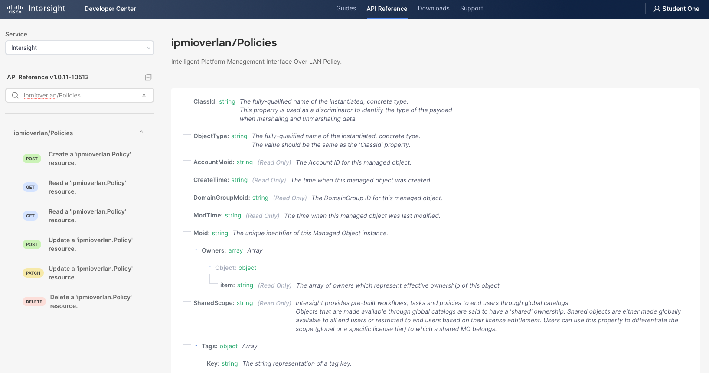
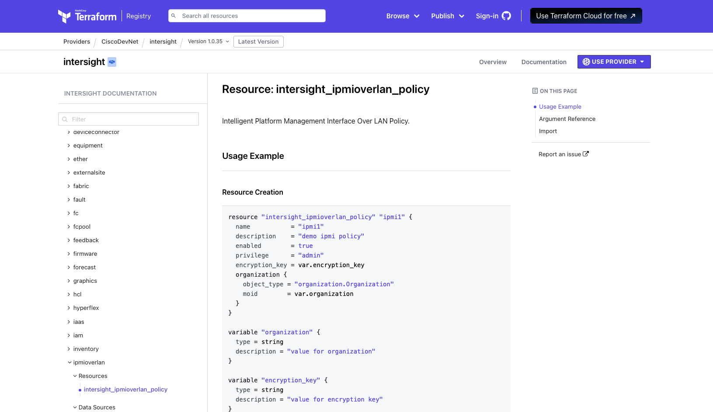
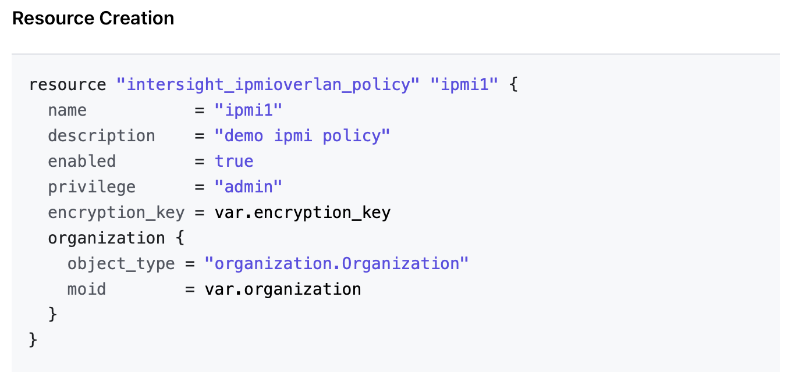

# Intersight Model and Terraform HCL for IPMI over LAN

In this section, we will configure a new policy in your student organization to **disable use of IPMI over LAN** function of the UCS Standalone Server.

## Identify the Policy

As mentioned in the slide based introduction, our first step is to get clues as to the policy name. We can do this by locating an existing IPMI over LAN policy in our Intersight interface and inspecting that policy's URL.

To do that, navigate to the [Intersight Policies](https://intersight.com/an/infrastructure-service/an/policy/policies/) tab.  Let's find the existing IPMI policy named **IPMI-Disabled** by simply typing **IPMI** into the filter box:



Double click on the **IPMI-Disabled** policy to be able to inspect the policy and URL as shown below:



This URL suggests a model name of "ipmioverlan-policy".  In searching for **ipmioverlan** in the Intersight REST API docs, we do indeed find the following entry: [ipmioverlan/Policy](https://intersight.com/apidocs/apirefs/ipmioverlan/Policies/model/)



Finally, let's identify the Terraform provider resource that corresponds to that model and policy, specifically [intersight_ipmioverlan_policy](https://registry.terraform.io/providers/CiscoDevNet/intersight/latest/docs/resources/ipmioverlan_policy):



## Modifying the Terraform

In the GitHub repository that you downloaded, you have been provided the stub of a Terraform configuration to implement this policy.  In the upper right editor, navigate to the **src/DEVWKS-2060-CLAMS23/02-intersight** directory and open the file **workshop-ipmi.tf**.  The contents are reproduced below:

```
# IPMI over LAN
resource "intersight_ipmioverlan_policy" "ipmi_disabled" {
  organization {
    object_type = "organization.Organization"
    moid        = local.target_org_moid
  }

  description = "IPMI over LAN disabled - Terraform deployed"
  name        = "IPMI-Disabled"

  # COMMENT OUT OR DELETE THE FOLLOWING LINE WHEN YOU ARE READY TO CONFIGURE THIS RESOURCE
  count = 0

  # ADD THE KEY/VALUE PAIRS BELOW

}
```

The changes needed to this policy are:

- Remove the **count = 0** line (this is a Terraform trick to disable the resource and we need to remove it).
- Add the attribute needed to disable the IPMI over LAN feature.

From the Terraform documentation, we see exactly what we need to reproduce:




Your task is to edit the Terraform file **workshop-ipmi.tf** and make it resemble the following:

```
resource "intersight_ipmioverlan_policy" "ipmi_disabled" {
  organization {
    object_type = "organization.Organization"
    moid        = local.target_org_moid
  }

  description = "IPMI over LAN disabled - Terraform deployed"
  name        = "IPMI-Disabled"
  enabled     = false
}
```

## Deploying the Terraform

Once the file is finished, let's apply it:

```bash
cd src/DEVWKS-2060-CLAMS23/02-intersight
terraform init
terraform apply
terraform apply --auto-approve
```

The output from the **terraform apply** command is:

```
Terraform used the selected providers to generate the following execution plan. Resource actions are indicated with the
following symbols:
  + create

Terraform will perform the following actions:

  # intersight_ipmioverlan_policy.ipmi_disabled will be created
  + resource "intersight_ipmioverlan_policy" "ipmi_disabled" {
      + account_moid          = (known after apply)
      + ancestors             = (known after apply)
      + class_id              = "ipmioverlan.Policy"
      + create_time           = (known after apply)
      + description           = "IPMI over LAN disabled - Terraform deployed"
      + domain_group_moid     = (known after apply)
      + enabled               = false
      + id                    = (known after apply)
      + is_encryption_key_set = (known after apply)
      + mod_time              = (known after apply)
      + moid                  = (known after apply)
      + name                  = "IPMI-Disabled"
      + object_type           = "ipmioverlan.Policy"
      + organization          = [
          + {
              + additional_properties = null
              + class_id              = "mo.MoRef"
              + moid                  = "63d9c0bd6972652d333dfd50"
              + object_type           = "organization.Organization"
              + selector              = null
            },
        ]
      + owners                = (known after apply)
      + parent                = (known after apply)
      + permission_resources  = (known after apply)
      + privilege             = "admin"
      + profiles              = (known after apply)
      + shared_scope          = (known after apply)
      + tags                  = (known after apply)
      + version_context       = (known after apply)
    }

Plan: 1 to add, 0 to change, 0 to destroy.
intersight_ipmioverlan_policy.ipmi_disabled: Creating...
intersight_ipmioverlan_policy.ipmi_disabled: Creation complete after 1s [id=63d9c7e86275722d31695afa]

Apply complete! Resources: 1 added, 0 changed, 0 destroyed.

Outputs:

org_target_moid = "63d9c0bd6972652d333dfd50"
```
