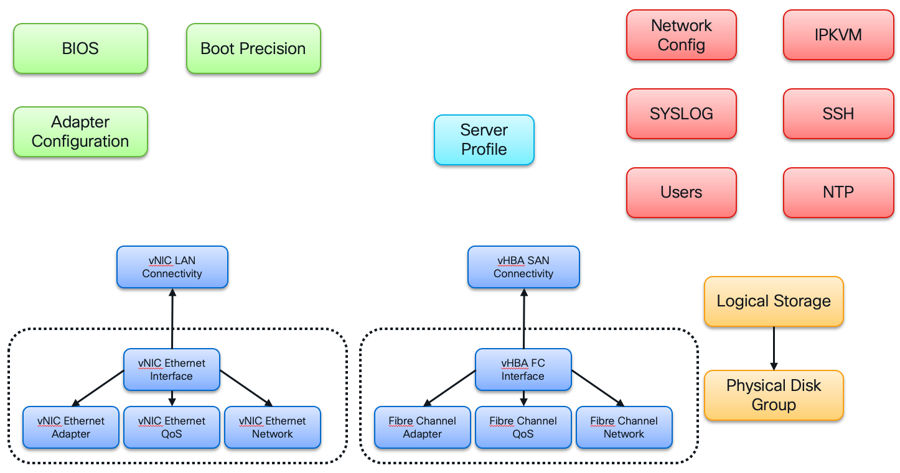
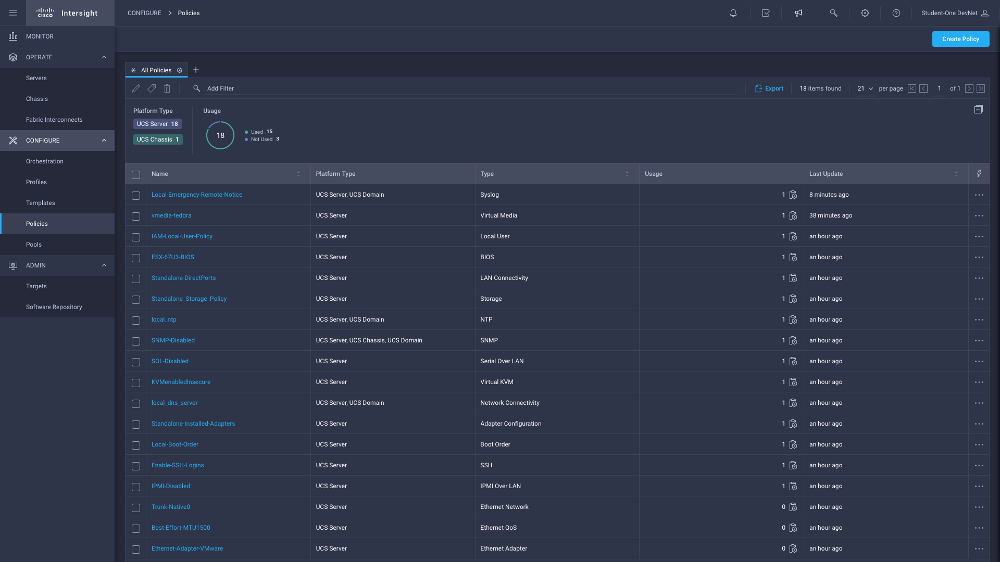
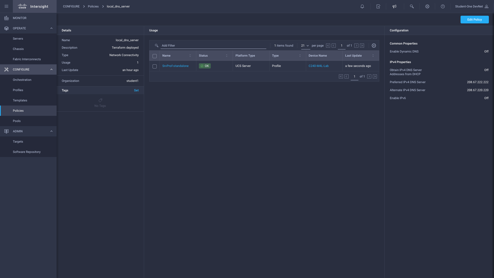
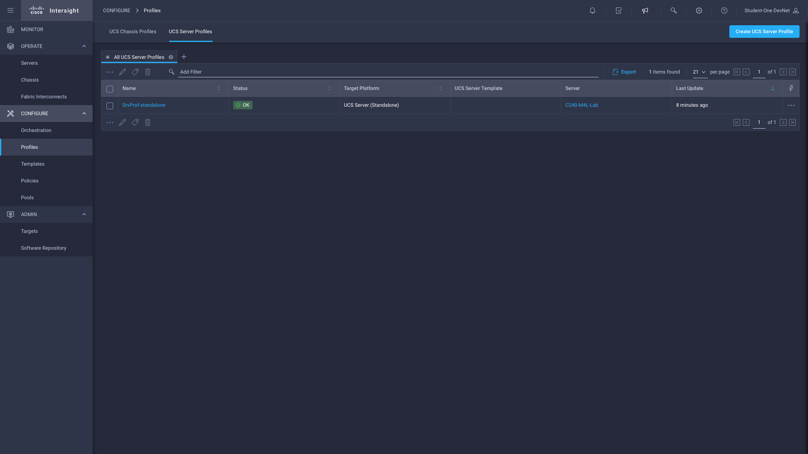
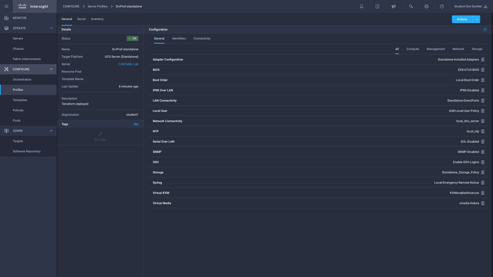
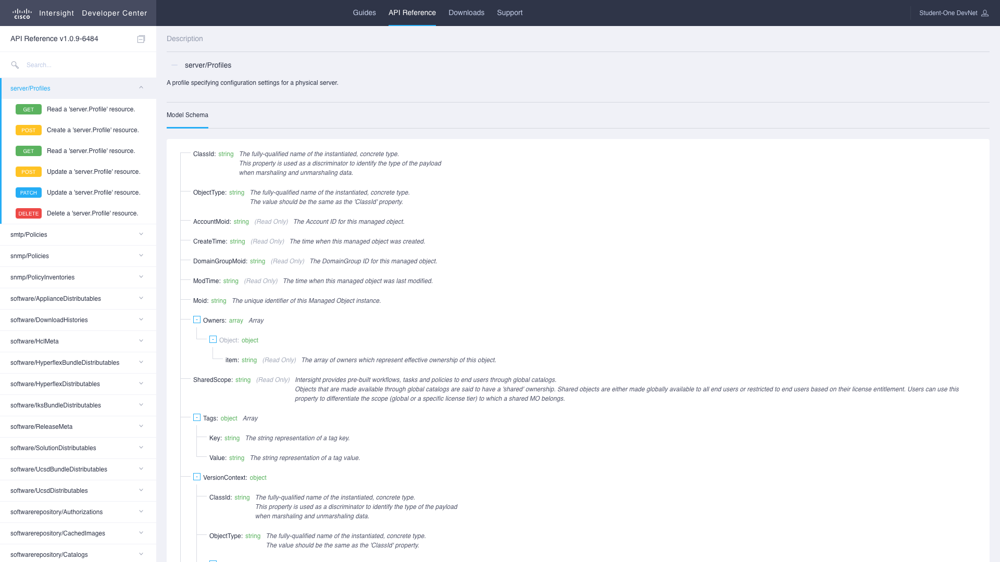
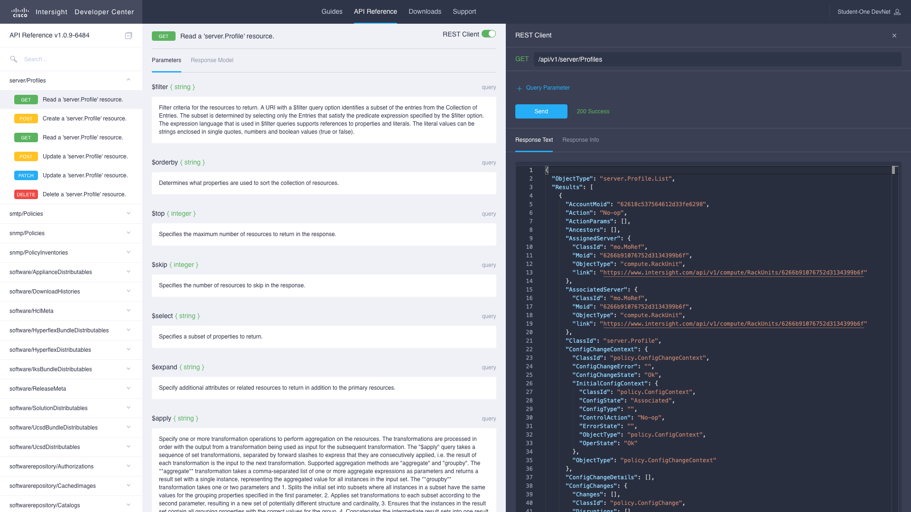

# Standalone Server Profiles

For an overview of server profiles and UCS C-series servers operating in "standalone" mode of operation, please refer to the [Introduction](./01-intro.md).

As the Terraform provider resources directly map to Intersight models, we will be referring to this drawing below as we step through the Terraform configuration.



## Intersight Terraform Provider

### Server Profile resource

The heart of the server profile is the **server/Profile** resource ([REST API](https://intersight.com/apidocs/apirefs/server/Profiles/model), [Terraform Provider](https://registry.terraform.io/providers/CiscoDevNet/intersight/latest/docs/resources/server_profile)). Let's take a quick look at the resource definition in the workshop Terraform configuration. You can open it in the editor pane to the right (**src/DEVWKS-2060-CLUS22/02-standalone/server.tf**) or view it in the terminal using the below command.

```bash
cd ${HOME}/src/DEVWKS-2060-CLUS22/02-standalone
cat server.tf
```

The file only has the single resource defined:

```hcl
# Create the Server Profile
resource "intersight_server_profile" "standalone" {
  organization {
    object_type = "organization.Organization"
    moid        = local.target_org_moid
  }

  description     = "Terraform deployed"
  name            = "SrvProf-standalone"
  target_platform = "Standalone"
}

output "standalone_sp_moid" {
  value = intersight_server_profile.standalone.moid
}
```

The resource type - intersight_server_profile - follows the standard Terraform naming convention which prefixes the provider name (intersight) to the Intersight resource type (server_profile). Similarly, Intersight has defined a standard mapping of its models and corresponding REST API endpoint to the Terraform resource type.

- "server_profile" maps to the model/class "server.Profile" 
- which has a corresponding REST API endpoint [server/Profiles](https://intersight.com/api/v1/server/Profiles)
- that has [OpenAPI generated documentation](https://intersight.com/apidocs/apirefs/server/Profiles/model)
- as well as [Terraform provider docs](https://registry.terraform.io/providers/CiscoDevNet/intersight/latest/docs/resources/server_profile)

Each of these elements (models, API, API docs, Terraform provider and its docs) are auto-generated with each update to Intersight so that they are kept in-sync with the current SaaS service.

Many Intersight provider resources will have a few common [arguments and blocks](https://www.terraform.io/language/syntax/configuration#arguments-and-blocks):

- **organization** block: assigns the created Terraform resources as Intersight managed objects (MOs) into the specified organization.
- **description** attribute: A free form description field for "human" reference.
- **name** attribute: self evident. Object name subject to specific character limitations (URI driven).

The remaining attributes are specific to the resource being created, described more fully in the Terraform provider for each specific resource.

### Organization resource

The organization resource referenced in the server_profile is actually created outside of this workshop by the instructor. However, this workshop Terraform configuration must reference it throughout the other resources.  The Terraform mechanism to do so is via data sources and managed in the main.tf file.  Let's review its contents as well (editor to the right: **src/DEVWKS-2060-CLUS22/02-standalone/main.tf**)

```bash
cd ${HOME}/src/DEVWKS-2060-CLUS22/02-standalone
cat main.tf
```

Excerpt of output of main.tf:

```hcl
# Pull managed object information related to the studentX organization
data "intersight_organization_organization" "target" {
  name        = var.target_organization
}

output "org_target_moid" {
  value = data.intersight_organization_organization.target.results[0].moid
}

# Local vars for easy reference
locals {
  target_org_moid = data.intersight_organization_organization.target.results[0].moid
}
```

Within the Intersight provider, the data source entities invoke a REST API call (GET method) with a query parameter to search for the desired managed objects. The provider returns most data source search results as a list, even if the parameter selection by necessity must return a single result,  As you see above, most data source specifications would typically return a single result and as such a common practice is to use a local variable to simplify the use of the information through the Terraform configuration.

### Glance at all resources leveraged

Lastly, to get a quick view of all the Intersight Terraform provider resources we are leveraging, we can run a quick and dirty Linux command:

```bash
cd ${HOME}/src/DEVWKS-2060-CLUS22/02-standalone
awk '/^resource/ { print $2; }' *.tf | sort | uniq | cut -d'"' -f2
```

whose output is:

```
intersight_adapter_config_policy
intersight_bios_policy
intersight_boot_precision_policy
intersight_iam_end_point_user
intersight_iam_end_point_user_policy
intersight_iam_end_point_user_role
intersight_ipmioverlan_policy
intersight_kvm_policy
intersight_networkconfig_policy
intersight_ntp_policy
intersight_server_profile
intersight_snmp_policy
intersight_sol_policy
intersight_ssh_policy
intersight_storage_drive_group
intersight_storage_storage_policy
intersight_syslog_policy
intersight_vmedia_policy
intersight_vnic_eth_adapter_policy
intersight_vnic_eth_if
intersight_vnic_eth_network_policy
intersight_vnic_eth_qos_policy
intersight_vnic_lan_connectivity_policy
```

## Deploying the Server Profile

Enough talk, let us get to business and deploy a standalone server profile. We have the configuration completely specified so the correct steps are the typical:

```bash
cd ${HOME}/src/DEVWKS-2060-CLUS22/02-standalone
terraform init
terraform plan
terraform apply --auto-approve
```

If all goes well, your should see the following summary in your output (with different MOID values, of course):

```
Apply complete! Resources: 26 added, 0 changed, 0 destroyed.

Outputs:

org_target_moid = "62841a936972652d325ccd2e"
standalone_sp_moid = "6285bb5777696e2d3152ddf1"
storage_disk_group_moid = "6285bb59656f6e2d3047f032"
storage_policy_moid = "6285bb58656f6e2d3047eff7"
```

## Exploring Results in Intersight

Now let's quickly look at those policies and server profiles in Intersight. In another browser tab, navigate to the following URL for policies: 

```
https://www.intersight.com/an/policy/policies/
```

The full list of policies you created with Terraform are shown below:



An example policy that we created (DNS Server configuration) is examined below:



Now, let's navigate to the server profile view to examine your handiwork:

```
https://www.intersight.com/an/policy/profiles/server/
```



Drilling into the details of our server profile, we'll see the policies that we've bound to that profile:



## A View to Discovery

Let's go over to the API and look at a couple of these objects:

```
https://intersight.com/apidocs/apirefs/server/Profiles/model
```

Interactively, we'll look at the overall model attributes as shown in the following screen:



We'll also see how we can leverage the OpenAPI spec documentation to help us build out our Terraform configuration:



## Summary

That concludes our foray into building a single server profile for UCS C-series servers in standalone mode of operation. The next section will take us through Intersight modes of operation.

Let's clean up our previous work in preparation for the next section:

```bash
terraform destroy --auto-approve
```

Remember: Because of parallelism in the provider and API, you'll likely have to run this more than once until there are no errors.
