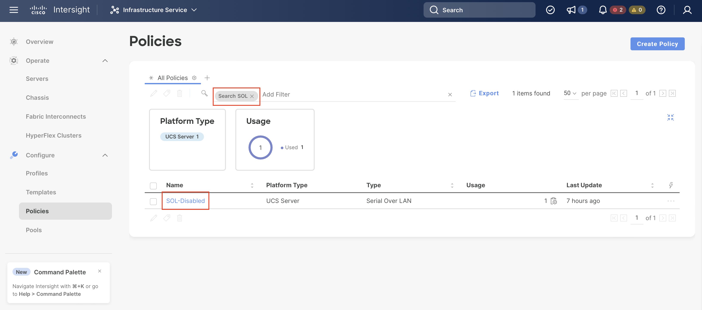
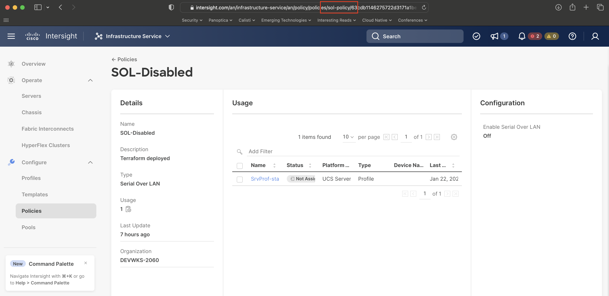
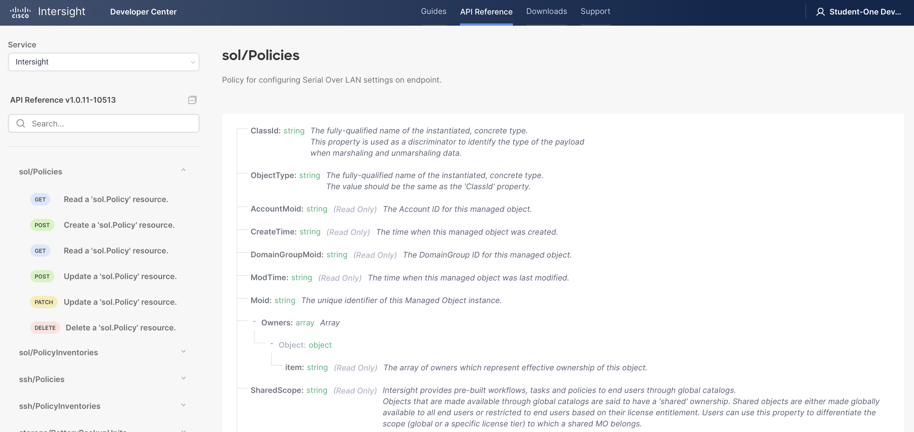
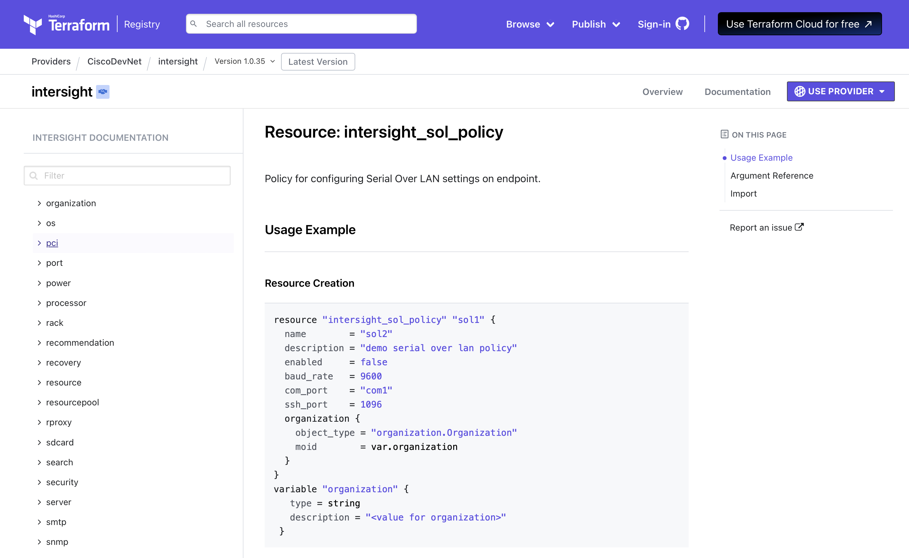

# Intersight Model and Terraform HCL for Serial over LAN

In this section, we will configure a new policy in your student organization to **disable use of Serial over LAN** function of the UCS Standalone Server.

This section will closely mimic our last section on [disabling IPMI over LAN](./02-terraform-intersight-ipmi.md). As a result, we will abbreviate the instructions here.

## Identify the Policy

Let's return to the [Intersight Policies](https://intersight.com/an/infrastructure-service/an/policy/policies/) tab and locate the existing Serial over LAN (SoL) policy named **SOL-Disabled** by simply typing **SOL** into the filter box:



Double click on the **SOL-Disabled** policy to be able to inspect the policy and URL as shown below:



This URL suggests a model name of "sol-policy".  In searching for **sol** in the Intersight REST API docs, we do indeed find the following entry: [sol/Policy](https://intersight.com/apidocs/apirefs/sol/Policies/model/)



Finally, let's identify the Terraform provider resource that corresponds to that model and policy, specifically [intersight_sol_policy](https://registry.terraform.io/providers/CiscoDevNet/intersight/latest/docs/resources/sol_policy):



## Modifying the Terraform

In the GitHub repository that you downloaded, you have been provided the stub of a Terraform configuration to implement this policy.  In the upper right editor, navigate to the **src/DEVWKS-2060-CLAMS23/02-intersight** directory and open the file **workshop-sol.tf**.

As before, we need to make two changes to this policy:

- Remove the **count = 0** line (this is a Terraform trick to disable the resource and we need to remove it).
- Add the attribute needed to disable the Serial over LAN feature.

In looking at the **intersight_sol_policy** screenshot above, like the IPMI over LAN, we see a similar attribute (**enabled**) that we can leverage to disable the Serial over LAN functionality on the server.  To the end, your task is to edit the Terraform file **workshop-sol.tf** in the editor to the upper right and make it resemble the following:

```
# Serial over LAN
resource "intersight_sol_policy" "sol_disabled" {
  organization {
    object_type = "organization.Organization"
    moid        = local.target_org_moid
  }

  description = "Terraform deployed"
  name        = "SOL-Disabled"
  enabled     = false
}
```

## Deploying the Terraform

Once the file is finished, let's apply it:

```bash
cd src/DEVWKS-2060-CLAMS23/02-intersight
terraform init
terraform apply
terraform apply --auto-approve
```

The output from the **terraform apply** command is:

```
intersight_ipmioverlan_policy.ipmi_disabled: Refreshing state... [id=63d9cf316275722d316a4acb]

Terraform used the selected providers to generate the following execution plan. Resource actions are indicated with the
following symbols:
  + create

Terraform will perform the following actions:

  # intersight_sol_policy.sol_disabled will be created
  + resource "intersight_sol_policy" "sol_disabled" {
      + account_moid         = (known after apply)
      + ancestors            = (known after apply)
      + baud_rate            = 9600
      + class_id             = "sol.Policy"
      + com_port             = "com0"
      + create_time          = (known after apply)
      + description          = "Terraform deployed"
      + domain_group_moid    = (known after apply)
      + enabled              = false
      + id                   = (known after apply)
      + mod_time             = (known after apply)
      + moid                 = (known after apply)
      + name                 = "SOL-Disabled"
      + object_type          = "sol.Policy"
      + organization         = [
          + {
              + additional_properties = null
              + class_id              = "mo.MoRef"
              + moid                  = "63d9c0bd6972652d333dfd50"
              + object_type           = "organization.Organization"
              + selector              = null
            },
        ]
      + owners               = (known after apply)
      + parent               = (known after apply)
      + permission_resources = (known after apply)
      + profiles             = (known after apply)
      + shared_scope         = (known after apply)
      + ssh_port             = 2400
      + tags                 = (known after apply)
      + version_context      = (known after apply)
    }

Plan: 1 to add, 0 to change, 0 to destroy.
intersight_sol_policy.sol_disabled: Creating...
intersight_sol_policy.sol_disabled: Creation complete after 1s [id=63d9cf3f6275722d316a4c94]

Apply complete! Resources: 1 added, 0 changed, 0 destroyed.

Outputs:

org_target_moid = "63d9c0bd6972652d333dfd50"
```
