# Intersight Managed Server Profiles

With this section, you'll be digging deeper into server profiles, specifically for those server profiles intended for UCS servers (both B-series blades and C-series rack mounts) that are attached to UCS Fabric Interconnects running in Intersight mode.

Since there is a great deal of overlap between "standalone" and "intersight managed" server profiles, the content in this section will focus primarily on the differences between the profiles. The supporting GitHub repository will of course contain the complete Intersight server profile from which you'll deploy into Intersight.

For your reference, included below is a visual of data models for Intersight managed server profiles.

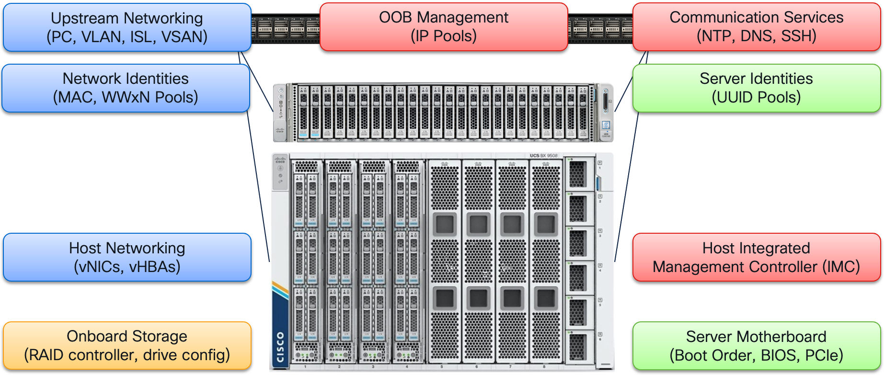

## Evolution of Provider

The first difference you'll notice in the Terraform configuration actually has nothing to do with differences between server operation styles (standalone vs Intersight). This difference has to deal with the model relationships and how we bind policies and profiles together. The REST API and provider are under constant development (agile feature delivery). So capabilities are naturally evolving over time and this welcomed change we'll discuss was added based on customer and engineer feedback.

At first publication, the Intersight REST API models and **specifically** their relationships were "inverted" from the original XML API models in the UCS Manager. Let's look specifically at the Intersight server_profile model.

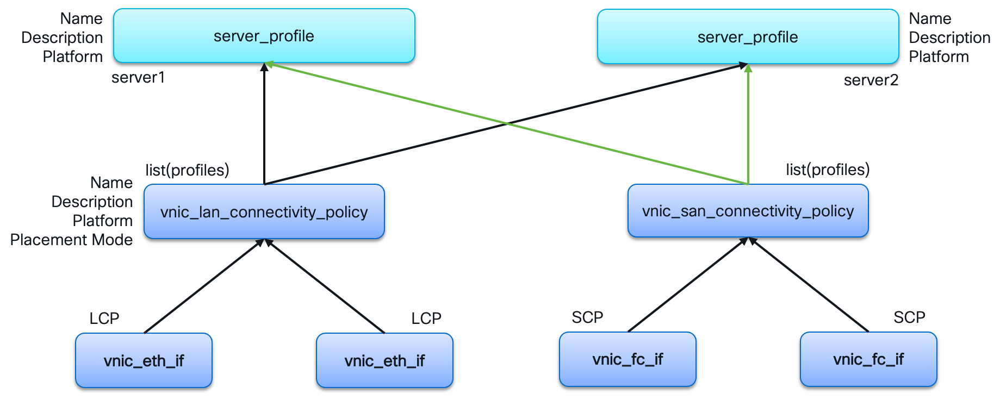

By default, it is a primary class that other resources, such as the LAN Connectivity Policy (vnic_lan_connectivity_policy resource), have attributes that then refer to the server_profile managed object. In this approach, all the building block policies have to reference all the server_profile instances to which they belong. The challenge with this approach is that all the various policies have to be modified in order to add another server profile to the system.

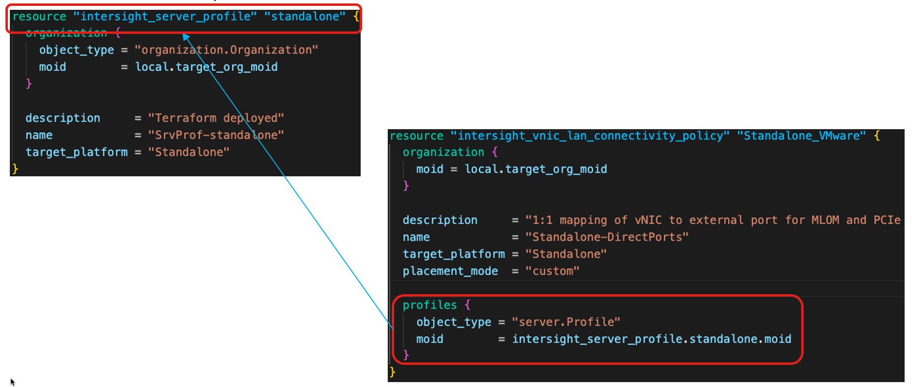

For reference, in the original XML API models of UCSM, the service profile had attributes that referenced the various building block policies required for the profile. In this original approach, automation creates the reusable policies once and they are not modified unless there is a specific policy change. The service profiles are then created and reference the building blocks without modification.

In the context of Terraform, the original Intersight approach has significant operational impact in that common policies could not be shared across projects that were managing their resources independently, violating the notion of "don't repeat yourself" (DRY).

To address this concern, you'll see in the Intersight managed server profile resource the specification of "policy buckets", returning the behavior of the original XML API models. The relationship diagram for the policy bucket approach is shown first.

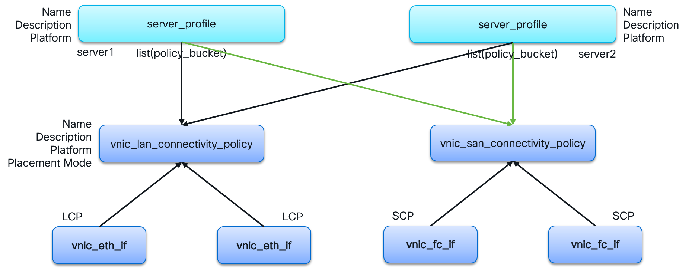

The impact on the Terraform configuration is depicted below.

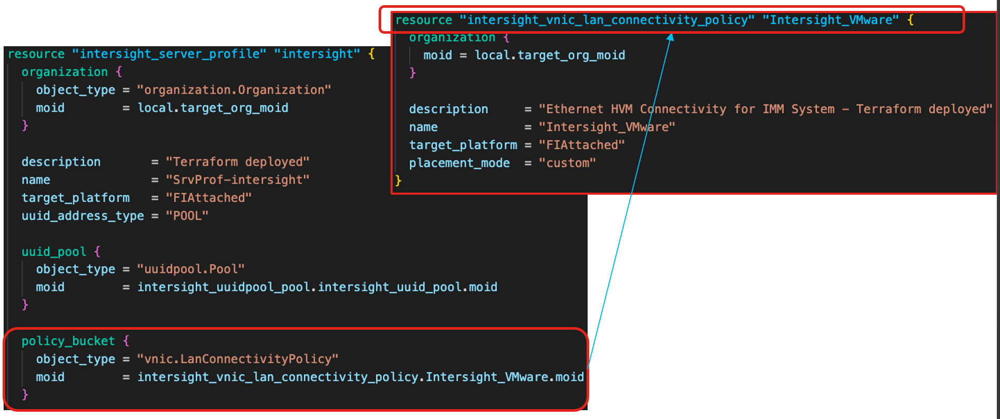

In this simple example, all the resources for the building block policies are explicitly created but, in a production environment, you'd have a common Terraform build the standardized policies and the Terraform above would reference them via data sources.

## Disaggregation of Resources

The more practical difference between management styles for UCS servers is the disaggregation of common elements from the individual servers and centralizing them into the fabric interconnects, or "domain". Some common elements that shift completely from server to the domain are:

- NTP
- DNS
- Network VLAN, Storage VSAN
- Network and Storage physical uplinks

A capability unique to UCS domains since its foundation is the separation of server identities from the physical server itself. Unique identifiers (MAC, WWxN, UUID) that were physically bound to hardware are now defined in identity policies and owned logically by the server profile.

Graphically, we can show the separation of duties with the Intersight managed mode of operation (note: this high level diagram is also true for the original UCS Managed domain operation).


## End Theory, Begin Practical

What's it all mean? Well, the short of it is that many resources will be the same between server profile types (Intersight or Standalone). For Intersight managed server profiles, we'll exchange the network and storage resources for fabric attached models and remove resources that belong to the domain. For completeness, the exercise will manage the domain relevant policies specific to server profiles (identity pools, for example).

And just to add some spice, we add fiber channel into the mix since UCS domains allow for that in a simple way. So, let's take a look at the list of resources we are leveraging for this section:

```bash
cd ${HOME}/src/DEVWKS-2060-CLUS22/03-intersight
awk '/^resource/ { print $2; }' *.tf | sort | uniq | cut -d'"' -f2
```

with the resulting output:

```
intersight_access_policy
intersight_bios_policy
intersight_boot_precision_policy
intersight_fabric_eth_network_control_policy
intersight_fabric_eth_network_group_policy
intersight_fcpool_pool
intersight_iam_end_point_user
intersight_iam_end_point_user_policy
intersight_iam_end_point_user_role
intersight_ipmioverlan_policy
intersight_ippool_pool
intersight_kvm_policy
intersight_macpool_pool
intersight_server_profile
intersight_snmp_policy
intersight_sol_policy
intersight_storage_storage_policy
intersight_syslog_policy
intersight_uuidpool_pool
intersight_vmedia_policy
intersight_vnic_eth_adapter_policy
intersight_vnic_eth_if
intersight_vnic_eth_qos_policy
intersight_vnic_fc_adapter_policy
intersight_vnic_fc_if
intersight_vnic_fc_network_policy
intersight_vnic_fc_qos_policy
intersight_vnic_lan_connectivity_policy
intersight_vnic_san_connectivity_policy
```

Now, let's get to business. But, first, before we begin, did you clean up in the previous section (**terraform destroy**)? If not, there will be many an error come your way. The next command block provides the instructions from the previous section in case you need them.

```bash
# OPTIONAL: IF YOU DIDN'T CLEAN UP IN THE PREVIOUS SECTION
cd ${HOME}/src/DEVWKS-2060-CLUS22/02-standalone
terraform destroy --auto-approve
```

If things have gone horribly wrong and the above didn't work, use the "Emergency Cleanup Procedures" at the end of this section.

Safety lesson over - Let's deploy the Terraform configuration.

```bash
cd ${HOME}/src/DEVWKS-2060-CLUS22/03-intersight
terraform init
terraform plan
terraform apply --auto-approve
```

If all goes well, your should see the following summary in your output (with different MOID values, of course):

```
Apply complete! Resources: 48 added, 0 changed, 0 destroyed.

Outputs:

intersight_sp_moid = "6285bb5777696e2d3152ddf1"
org_target_moid = "62841a936972652d325ccd2e"
```

## Review the Fruits of Your Labor

Let's jump back into Intersight to check out the objects that have been deployed. We'll leverage the following three sections in your Intersight portal:

- [Configure->Profiles](https://www.intersight.com/an/policy/profiles/server/)

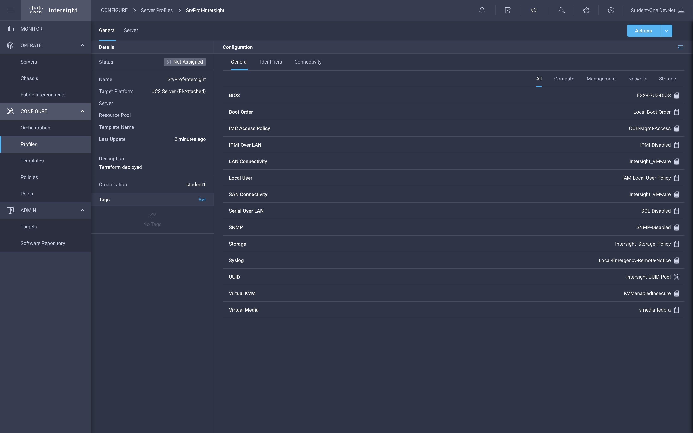

- [Configure->Policies](https://www.intersight.com/an/policy/policies/)

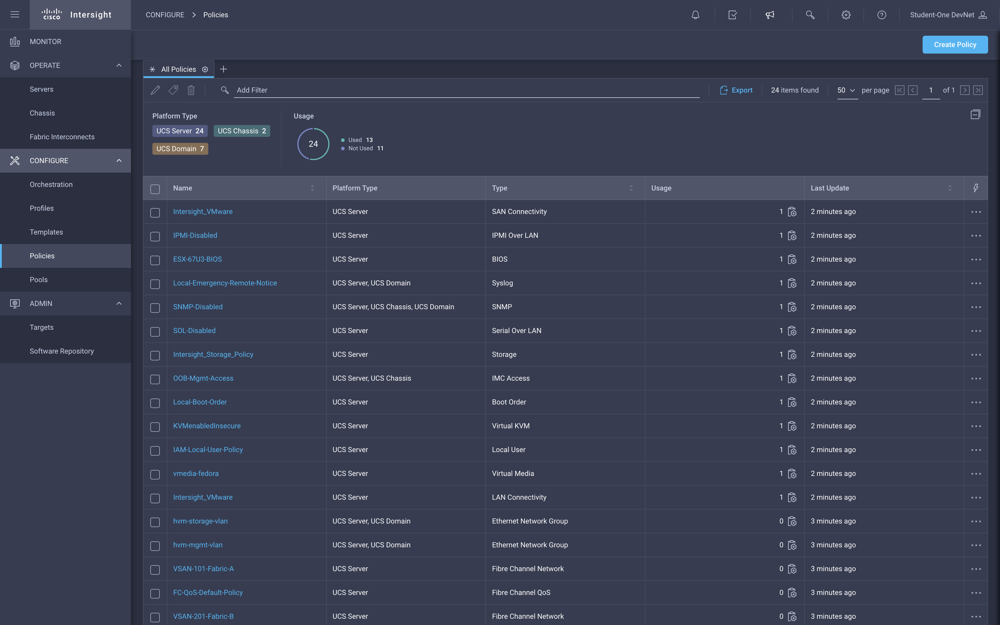

- [Configure->Pools](https://www.intersight.com/an/pool/pools/)

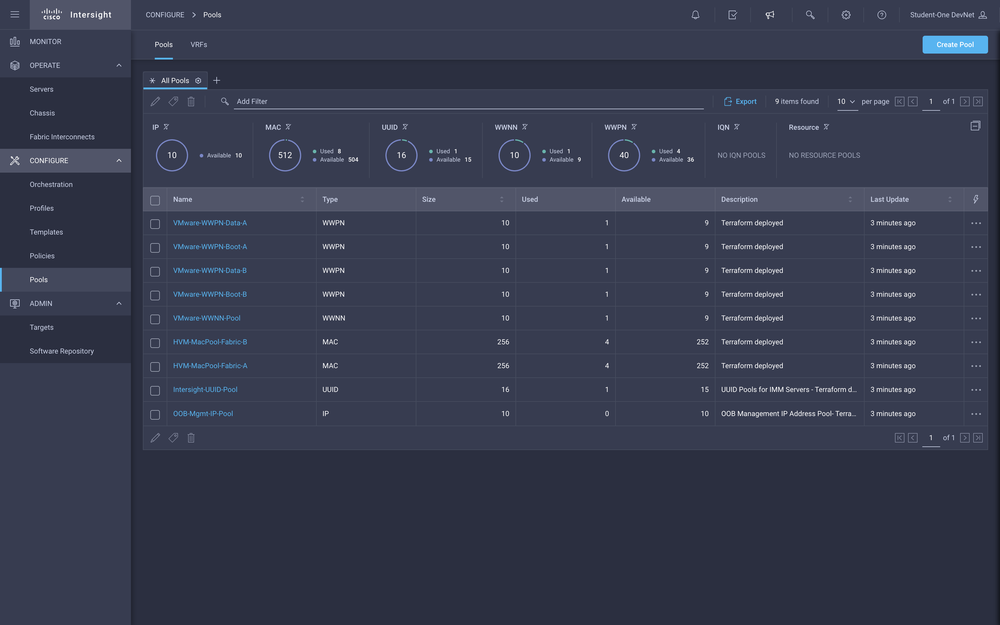

## Summary

That concludes our foray into building a single server profile for UCS C-series servers in Intersight managed mode of operation. The next section will show us how to scale these two types of profiles to large numbers of servers.

Let's clean up our previous work in preparation for the next section:

```bash
terraform destroy --auto-approve
```

Remember: Because of parallelism in the provider and API, you'll likely have to run this more than once until there are no errors.

## Emergency Cleanup Procedures

If things have gone horribly wrong and you need to clean up your Intersight organization to begin fresh, follow this procedure:

- login into intersight.com (should still have that window open, eh?)
- Navigate to https://intersight.com/an/policy/profiles/server/
    - Left Menu: Configure->Profiles
    - Center pane: UCS Server Profiles
    - Check the box next to the server profile and delete it (trash can icon)

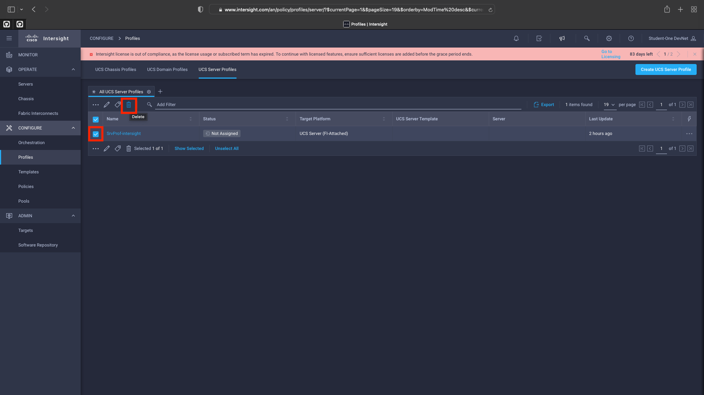

- Navigate to https://intersight.com/an/policy/policies/
    - Left Menu: Configure->Policies
    - Change view to display 50 items per page (center pane, right side of screen)
    - Select all policies and delete them (trash can icon)
        - You may have to do this multiple times because of possible race conditions

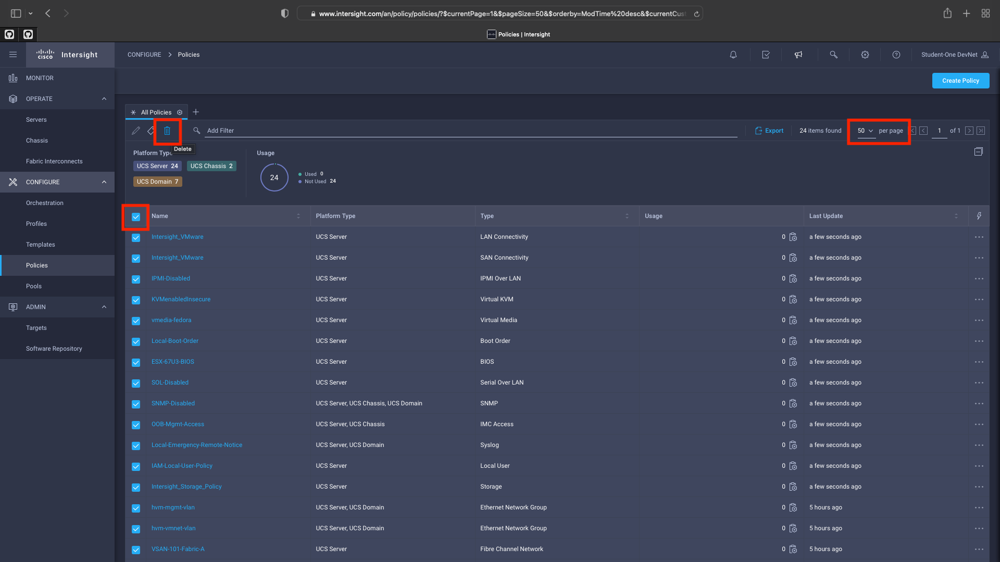

- Navigate to https://intersight.com/an/pool/pools/abstract/
    - Left Menu: Configure->Pools
    - Select all pools and delete them

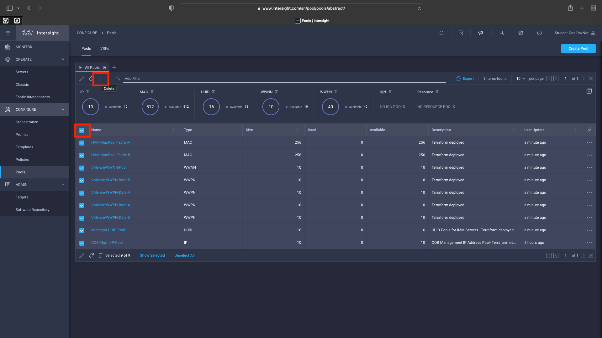

Finally, you'll need to clean up any Terraform state in your environment:

```bash
rm -rf .terraform* terraform.tfstate*
```

At this point, you'll resume the instructions at the point where you are instructed to run **terraform init**.
