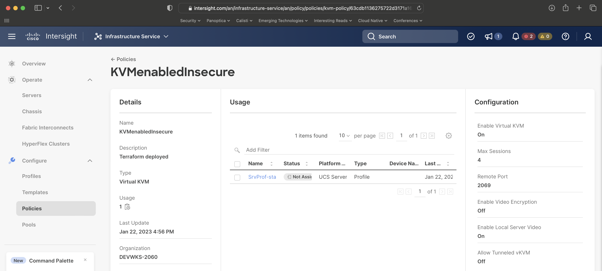
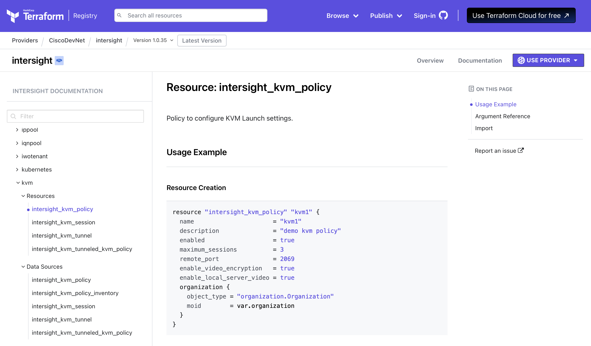

# Intersight Model and Terraform HCL for IP-KVM

In this section, we will configure a new policy in your student organization to **configure IP KVM** function of the UCS Standalone Server.

When we enable the IP-KVM functionality, we also want to configure the service to have the following settings:

- a maximum number of session of 4
- use the standard remote port of 2069
- enable the local server video
- disable the use of video encryption

As we are experienced automation engineers by this point, some of the screenshots have been left out for readability and brevity.

## Identify the Policy

Again, let's return to the [Intersight Policies](https://intersight.com/an/infrastructure-service/an/policy/policies/) tab and locate the existing policy named **KVMenabledInsecure** by simply typing **KVM** into the filter box.

Double click on the **KVMenabledInsecure** policy to be able to inspect the policy and URL as shown below:



This URL suggests a model name of "kvm-policy".  In searching for **kvm** in the Intersight REST API docs, we do indeed find the following entry: [kvm/Policy](https://intersight.com/apidocs/apirefs/kvm/Policies/model/)

As we've seen a couple times now, that Intersight REST API model translates to the Terraform provider resource named [intersight_kvm_policy](https://registry.terraform.io/providers/CiscoDevNet/intersight/latest/docs/resources/kvm_policy):



Given the requirements we laid out at the beginning of this section, in looking at the example provided in the documentation, I hope you can see how we will be modifying the Terraform in a short few minutes.

## Modifying the Terraform

In the GitHub repository that you downloaded, you have been provided the stub of a Terraform configuration to implement this policy.  In the upper right editor, navigate to the **src/DEVWKS-2060-CLAMS23/02-intersight** directory and open the file **workshop-ipkvm.tf**.

As before, we need to make two changes to this policy:

- Remove the **count = 0** line (this is a Terraform trick to disable the resource and we need to remove it).
- Add the attribute needed to enable the Serial over LAN feature.
- Add the attribute needed to enable the local video server
- Add the attribute needed to disable video encryption
- Add the attribute needed to set the IPKVM port

To wrap up the lab, your task is to edit the Terraform file **workshop-ipkvm.tf** in the editor to the upper right and make it resemble the following:

```
# IP-KVM
resource "intersight_kvm_policy" "kvm_enabled_insecure" {
  organization {
    object_type = "organization.Organization"
    moid        = local.target_org_moid
  }

  description               = "Terraform deployed"
  name                      = "KVMenabledInsecure"
  enabled                   = true
  maximum_sessions          = 4
  remote_port               = 2069
  enable_video_encryption   = false
  enable_local_server_video = true
}
```

## Deploying the Terraform

Once the file is finished, let's apply it:

```bash
cd src/DEVWKS-2060-CLAMS23/02-intersight
terraform init
terraform apply
terraform apply --auto-approve
```

The output from the **terraform apply** command is:

```
intersight_ipmioverlan_policy.ipmi_disabled: Refreshing state... [id=63d9cf316275722d316a4acb]
intersight_sol_policy.sol_disabled: Refreshing state... [id=63d9cf3f6275722d316a4c94]

Terraform used the selected providers to generate the following execution plan. Resource actions are indicated with the
following symbols:
  + create

Terraform will perform the following actions:

  # intersight_kvm_policy.kvm_enabled_insecure will be created
  + resource "intersight_kvm_policy" "kvm_enabled_insecure" {
      + account_moid              = (known after apply)
      + ancestors                 = (known after apply)
      + class_id                  = "kvm.Policy"
      + create_time               = (known after apply)
      + description               = "Terraform deployed"
      + domain_group_moid         = (known after apply)
      + enable_local_server_video = true
      + enable_video_encryption   = false
      + enabled                   = true
      + id                        = (known after apply)
      + maximum_sessions          = 4
      + mod_time                  = (known after apply)
      + moid                      = (known after apply)
      + name                      = "KVMenabledInsecure"
      + object_type               = "kvm.Policy"
      + organization              = [
          + {
              + additional_properties = null
              + class_id              = "mo.MoRef"
              + moid                  = "63d9c0bd6972652d333dfd50"
              + object_type           = "organization.Organization"
              + selector              = null
            },
        ]
      + owners                    = (known after apply)
      + parent                    = (known after apply)
      + permission_resources      = (known after apply)
      + profiles                  = (known after apply)
      + remote_port               = 2069
      + shared_scope              = (known after apply)
      + tags                      = (known after apply)
      + tunneled_kvm_enabled      = false
      + version_context           = (known after apply)
    }

Plan: 1 to add, 0 to change, 0 to destroy.
intersight_kvm_policy.kvm_enabled_insecure: Creating...
intersight_kvm_policy.kvm_enabled_insecure: Creation complete after 1s [id=63d9d53c6275722d316b5689]

Apply complete! Resources: 1 added, 0 changed, 0 destroyed.

Outputs:

org_target_moid = "63d9c0bd6972652d333dfd50"
```
